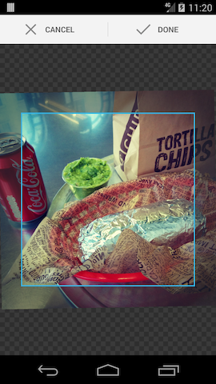

> I guess people are just cropping out all the sadness

An Android library project that provides a simple image cropping `Activity`, based on code from AOSP.

**Note:** We use this library in production without too many problems, but it's not maintained very actively. There are [other options](https://android-arsenal.com/tag/45) out there.

[](https://travis-ci.org/jdamcd/android-crop) 
[](http://search.maven.org/#artifactdetails%7Ccom.soundcloud.android%7Candroid-crop%7C1.0.1%7Caar.asc)
[](CHANGELOG.md)

## Features

* Gradle build & AAR
* Modern UI
* Backwards compatible to SDK 10
* Simple builder for configuration
* Example project

## Usage

First, declare `CropImageActivity` in your manifest file:

```xml
<activity android:name="com.soundcloud.android.crop.CropImageActivity" />
```

#### Crop

```java
Crop.of(inputUri, outputUri).asSquare().start(activity)
```

Listen for the result of the crop (see example project if you want to do some error handling):

```java
@Override
protected void onActivityResult(int requestCode, int resultCode, Intent result) {
    if (requestCode == Crop.REQUEST_CROP && resultCode == RESULT_OK) {
        doSomethingWithCroppedImage(outputUri);
    }
}
```
    
Some attributes are provided to customise the crop screen. See the example project [theme](https://github.com/jdamcd/android-crop/blob/master/example/src/main/res/values/theme.xml).

#### Pick

The library provides a utility method to start an image picker:

```java
Crop.pickImage(activity)
```

#### Dependency

The AAR is published on Maven Central:

```groovy
compile 'com.soundcloud.android:android-crop:1.0.1@aar'
```

#### Users

Apps that use this library include: [SoundCloud](https://play.google.com/store/apps/details?id=com.soundcloud.android), [Depop](https://play.google.com/store/apps/details?id=com.depop), [Polyvore](https://play.google.com/store/apps/details?id=com.polyvore), [TextSecure](https://play.google.com/store/apps/details?id=org.thoughtcrime.securesms)

## How does it look?



## License

This project is based on the [AOSP](https://source.android.com) camera image cropper via [android-cropimage](https://github.com/lvillani/android-cropimage).

    Copyright 2016 SoundCloud

    Licensed under the Apache License, Version 2.0 (the "License");
    you may not use this file except in compliance with the License.
    You may obtain a copy of the License at

       http://www.apache.org/licenses/LICENSE-2.0

    Unless required by applicable law or agreed to in writing, software
    distributed under the License is distributed on an "AS IS" BASIS,
    WITHOUT WARRANTIES OR CONDITIONS OF ANY KIND, either express or implied.
    See the License for the specific language governing permissions and
    limitations under the License.
